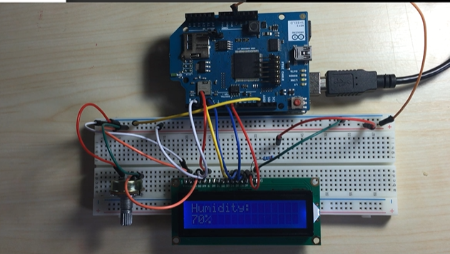

# Online-Weather-Station

The online weather station is developed using an Arduino UNO, Arduino WiFi shield (ESP8266), standard 1602 LCD and a potentiometer to set the contrast of the LCD.

The Arduino WiFi shield is mounted over the Arduino UNO and LCD, potentiometer and other components are connected to the WiFi shield.
The WiFi shield has access to the internet and draws the weather information directly from the internet and displays it on the LCD Screen.

The circuit diagram for our online weather station is as follows-

The virtual circuit looks like this-

